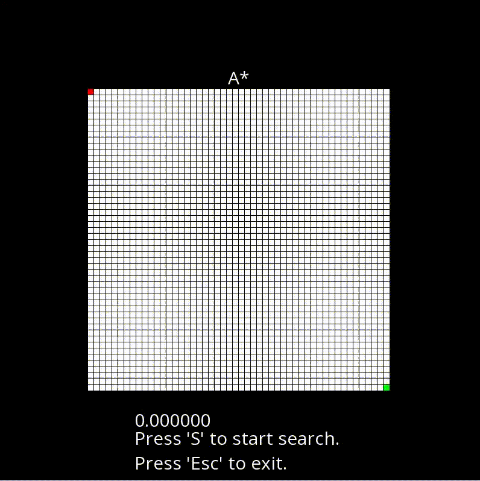

# SFML-Astar-pathfinding
Visualization of Astar and Djikstra grid-based pathfinding methods using SFML and C++.

## A*
<p align="center">
  
</p>

## Djikstra
Modify method variable in main.cpp to `Path::pathFindingMethod::Djikstra` for Djikstra visualization.

## Requirements

C++ 11+ and SFML (Simple and Fast Multimedia Library) is required to run the codes.

## Installation

Run the following command to install SFML on Linux (For other OS, please check the guide(s) available online) 

```
$ sudo apt-get install libsfml-dev
```

## How to Run

```
$ mkdir build
$ cmake -B build
$ cd build
$ make
$ ./prog
```

## Usage

Rerun simulation by pressing 's' on keyboard, press 'esc' to exit. <br><br/>
Add obstacles using left click on mouse.

## References

<details><summary> </summary>

* [https://github.com/OfficialCodeNoodles/Visualizing-Pathfinding-Algorithms](https://github.com/OfficialCodeNoodles/Visualizing-Pathfinding-Algorithms)
* [https://github.com/xSnapi/AStar-SFML-pathfinding-implementation](https://github.com/xSnapi/AStar-SFML-pathfinding-implementation)
* Data Structures for Game Programmers by Ron Penton.
</details>